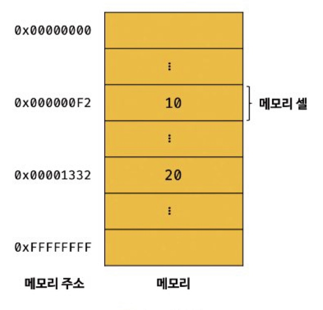

# 04. 변수

## 04-1 변수란 무엇인가? 왜 필요한가?

<br>
어플리케이션은 데이터를 입력(input) 받아 처리하고 그 결과를 출력(output) 한다.<br>
변수 -> 데이터를 관리하기 위한 핵심 개념
<br>
<br>

```javascript
10 + 20;
```

<br>

### - 자바스크립트가 위 코드를 계산하기 위해 필요한 것

1. 10, 20 이라는 리터럴에 대한 의미
2. +연산자에 대한 의미
3. 10 + 20 이라는 표현식의 의미를 해석 (파싱)
   <br>
   <br>

### - 컴퓨터는 CPU를 통해 연산. 메모리를 사용하여 데이터를 기억, 저장

<br/><br/>

1. 메모리
    - 데이터를 저장할 수 있는 메모리 셀의 집합체.
    - 메모리 셀 하나의 크기는 1바이트.
    - 컴퓨터는 메모리 셀의 크기 (1바이트 단위) 로 데이터를 저장, 읽는다.
2. 셀
    - 메모리 주소를 가짐.
    - 이때 메모리 주소는 메모리 공간의 위치를 말함.
    - 메모리 크기 만큼 정수로 표현.
      <br>
      <br>

### - 위의 식을 자바스크립트가 만났을 때 해석하는 방법

1. 10과 20인 숫자 리터럴을 메모리의 임의의 위치 (메모리 주소) 에 2진수 형태로 기억 (저장).
2. CPU에서 이 값을 읽어서 연산을 수행
3. 연산 결과 (30) 를 임의의 메모리 공간에 2진수 형태로 저장.

<br>

### - 문제점

-   CPU가 연산해서 만들어낸 숫자 값 30을 재사용하고 싶으면 메모리 주소를 통해 연산 결과 30이 저장된 메모리 공간에 직접 접근해야 함
-   메모리 주소에 접근하는 것은 오류 발생 위험
-   따라서 자바스크립트는 직접적인 메모리 제어 허용X
-   ---> 프로그래밍 언어는 기억하고 싶은 값을 메모리에 저장하고,
-   ---> 저장된 값을 읽어 들여 재사용하기 위해 변수라는 메커니즘 제공
<br>
<br>
<hr>
<br>

## 변수

-   변수는 하나의 값을 저장하기 위해 확보한 메모리 공간 자체 또는 그 메모리 공간을 식별하기 위해 붙인 이름
-   메모리에 저장된 값의 "위치"를 가리키는 상징적인 이름
    <br>

```javascript
var result = 10 + 20;
```

-   위 코드는 10과 20을 메모리 공간에서 가져와 + 연산을 하고, 30의 값을 다시 메모리에 넣는다.
-   result라는 변수에 30이라는 값이 넣은 곳의 주소를 가리킴<br/>
-   변수명을 식별자라고 부르고, 위 코드에서 result가 변수명(변수 이름) 이자 식별자.
-   변수 값 : 수의 저장된 값(30).
-   할당 (대입, 저장) : 변수에 값을 저장하는 것
-   참조 : 변수에 저장된 값을 읽는 것 <br/>
-   결국 변수는 --> 메모리 공간에 저장된 값(30)을 다시 읽어 들여 재사용 할 수 있도록 값이 저장된 메모리 공간에 상징적인 이름을 붙인 것

<br>

## 04-2 식별자

<br>

-   변수 이름
-   식별자 : 어떤 값을 구별해서 식별할 수 있는 고유한 이름
-   값이 저장되어 있는 메모리 주소와 매핑 관계를 맺으며, 이 매핑 정보도 메모리에 저장되어야 함.
-   식별자는 값이 아니라 메모리 주소를 기억하고 있다.
-   식별자로 값을 구분해 식별 -> 메모리 주소를 통해 그 공간에 저장된 값에 접근할 수 있다는 의미
-   즉, 식별자는 메모리 주소에 붙인 이름
-   변수, 함수, 클래스 모두 식별자. (메모리 상 존재하는 어떤 값을 식별할 수 있는 이름 모두 식별자라고 함.)
-   변수 이름 -> 메모리 상에 존재하는 변수 값을 식별
-   함수 이름 -> 메모리 상에 존재하는 함수 식별

<br>

## 04-3 변수 선언

<br>

-   변수를 생성하는 것을 말함
-   값을 저장하기 위한 메모리 공간을 확보. 변수 이름과 확보된 메모리 공간의 주소를 연결하여 값을 저장할 수 있게 준비하는 것.
-   변수 선언에 의해 확보된 메모리 공간은 변수가 해제되기 전까지 공간 사용할 수 없도록 보호
-   변수를 사용하려면 선언이 필요하고, 이렇게 선언할 때는 키워드 (var, let, const) 사용
-   키워드 : 자바스크립트 코드를 해석하고 실행하는 자바스크립트 엔진이 수행할 동작을 규정한 일종의 명령어
-   변수 이름은 어디에 등록되는가?
-   --> 모든 식별자는 실행 컨텍스트에 등록.
-   --> 실행 컨텍스트 : 자바스크립트 엔진이 소스코드를 평가, 실행을 위해 필요한 환경을 제공. 코드의 실행 결과를 실제로 관리하는 영역. 이곳을 통해 식별자, 스코프 관리

```javascript
var score; // 변수 선언
```

-   변수 선언 이후 값이 할당 X
-   -> 메모리 공간이 비어있을 것으로 생각할 수 있으나, undefined라는 값이 할당, 초기화됨.
    <br>
    <br>

### 변수 선언 단계

<br>

    1. 선언 단계  : 변수 이름을 등록하여 자바스크립트 엔진에 변수의 존재를 알림
    2. 초기화 단계 : 값 저장을 위한 메모리 공간 확보. 암묵적으로 undefined 할당하여 초기화한다.

-   초기화 단계를 거치지 않으면 확보된 메모리 공간에는 이전에 다른 애플리케이션이 사용한 값이 남아있을 수 있다. --> 이를 쓰레기 값(garbage value)이라고 함.
-   var는 초기화를 수행하므로 이러한 위험으로부터 안전함
-   변수를 사용하려면 반드시 선언이 필요
-   선언하지 않은 식별자에 접근하면 ReferenceError(참조 에러) 발생.
-   ReferenceError : 식별자를 통해 값을 참조하려 했으나 자바스크립트 엔진이 등록된 식별자를 찾을 수 없을 떄 발생하는 에러.
